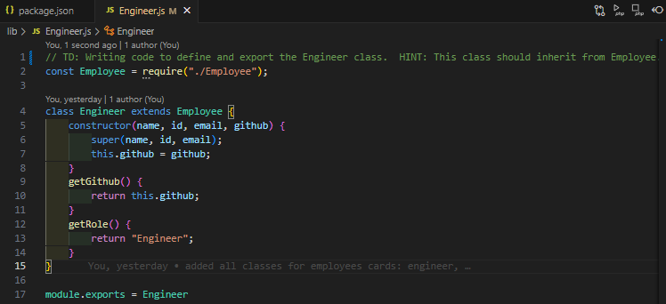
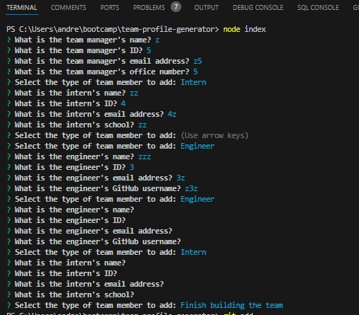
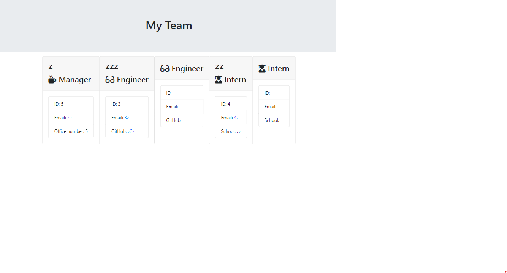

#  team-profile-generator
test-driven-developement
## Description
This Node.js application assists you in generating an HTML webpage that displays summaries of your development team members, providing quick access to their emails and GitHub profiles (for engineers).
In consequence it allows you to manage your development team.

## Table of Contents 
- [Description](#description)
- [Installation](#installation)
- [Usage](#usage)
- [Credits](#credits)
- [License](#license)
- [Features](#features)
- [Tests](#tests)

## Installation

1. Clone this repository to your local machine.
2. Navigate to the project directory.
3. Run `npm init -y` to install the required dependencies and then 'npm install inquirer@8.2.4' to install the inquirer version mentioned above.

## Usage
1. Open your terminal or command prompt.
2. Navigate to the project directory.
3. Run `node index.js` to start the application.
4. Follow the prompts to add team members (Managers, Engineers, and Interns).
5. Once all team members are added, an HTML file (`team.html`) will be generated in the `output` folder.` You can open this file in your browser to view the generated team page.
Further down it can be seen some code and html file generated in the `output` folder:

## Credits
https://jestjs.io/docs/getting-started
https://developer.mozilla.org/en-US/docs/Web/JavaScript/Reference/Classes#inheritance
https://developer.mozilla.org/en-US/docs/Web/JavaScript/Reference/Functions/Arrow_functions
https://developer.mozilla.org/en-US/docs/Web/JavaScript/Reference/Statements/const
https://www.npmjs.com/package/jest

## License
This project is licensed under the MIT License.

## Features
Functionality:
    Prompts the user to enter details for:
        Manager: Name, ID, Email, Office Number
        Engineer: Name, ID, Email, GitHub username
        Intern: Name, ID, Email, School
    Presents a menu to allow adding new team members (Add an Engineer, Add an Intern, Finish building the team).
    Generates an HTML webpage displaying each team member's information.
Project Structure:
    index.js: Main application entry point.
    lib: Directory containing class files:
        Employee.js: Base class for all team members.
        Engineer.js: Class for Engineer team members.
        Intern.js: Class for Intern team members.
        Manager.js: Class for Manager team member.
    src: Directory containing miscellaneous files:
        page-template.js: Function to generate the HTML page structure.
    tests: Directory containing unit tests for each class.
    output: Directory to store the generated HTML file (team.html).
Additional Notes:
-Consider using input validation to ensure user-entered data is in the correct format.
-This is a basic implementation and can be further enhanced with features like:
    Saving team members to a file or database.
     Adding styling to the generated HTML page.

## Tests
Unit tests for each class are provided in the tests directory. You can run these tests using a test runner like Jest: in terminal run command 'npm test'.

